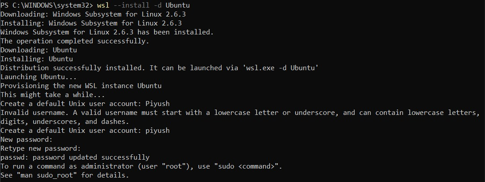
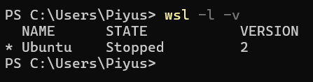
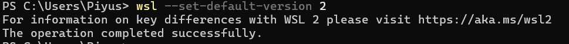
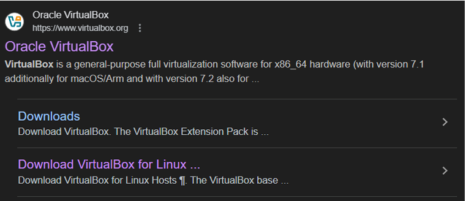
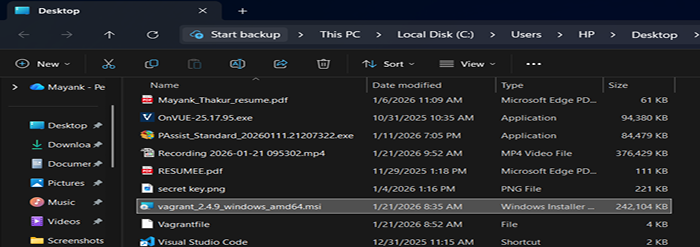
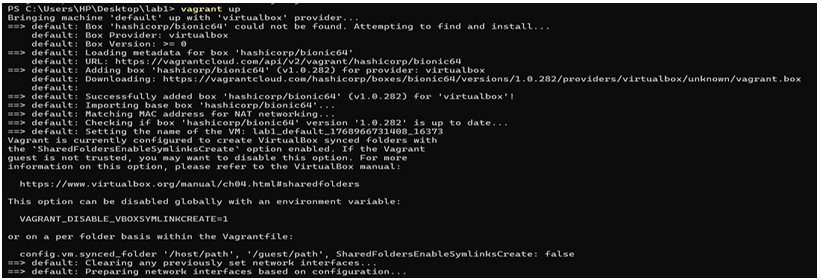
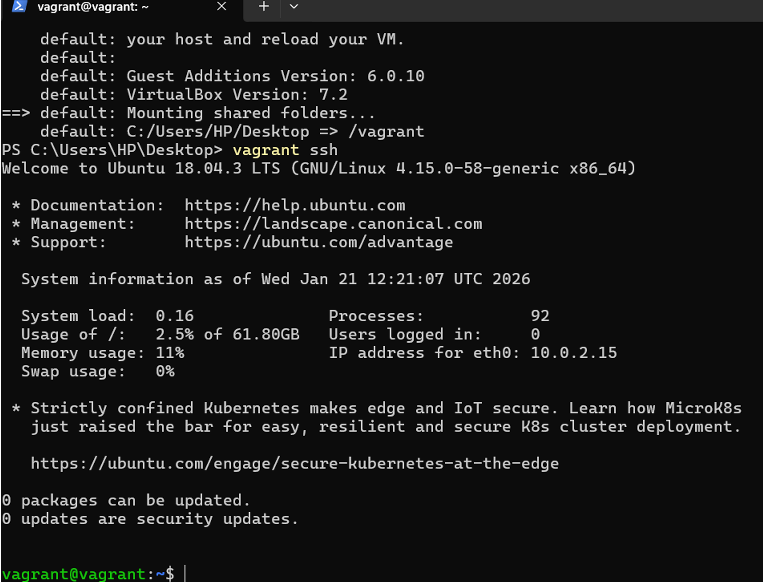
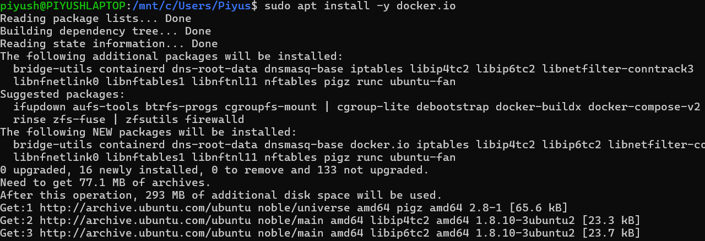
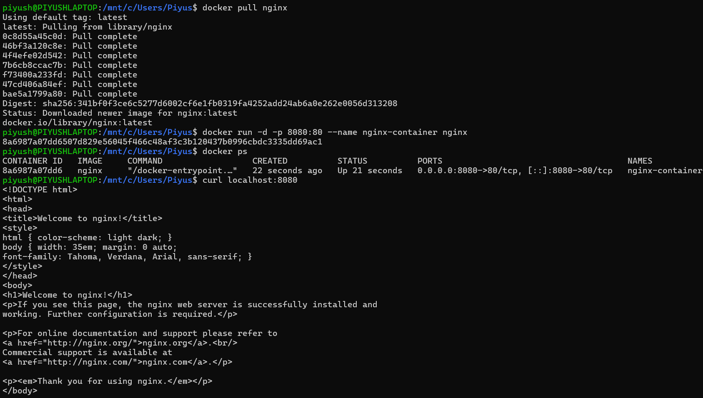

# Containerization and DevOps Lab  
## Experiment – 1  

---

## Student Details
- **Name:** Piyush Arora  
- **Roll No:** R2142230330  
- **SAP ID:** 500121925  
- **Course:** Containerization and DevOps Lab  
- **University:** UPES, Dehradun  

---

# EXPERIMENT – 0  
## Installation and Configuration of Windows Subsystem for Linux (WSL)

---

## Aim
To install and configure Windows Subsystem for Linux (WSL) on a Windows machine and set up an Ubuntu Linux distribution for running Linux commands and DevOps tools on Windows.

---

## Theory
Windows Subsystem for Linux (WSL) is a compatibility layer developed by Microsoft that allows users to run a Linux environment directly on Windows without the need for a virtual machine or dual-boot system.

WSL enables developers to:
- Run Linux command-line tools directly on Windows  
- Use Linux-based tools such as Git, Docker, Podman, and Vagrant  
- Integrate Linux workflows with Windows applications  

### Versions of WSL
- **WSL 1:** Uses a translation layer between Linux and Windows kernel  
- **WSL 2:** Uses a real Linux kernel with better performance  

👉 **WSL 2 is recommended** for containerization and DevOps workflows.

---

## System Requirements
- Windows 10 (Version 2004 or later) / Windows 11  
- Administrator access  
- Virtualization enabled in BIOS  
- Internet connection  

---

## Procedure

### Step 1: Install WSL and Ubuntu
Open **PowerShell as Administrator** and run:
```bash
wsl --install -d Ubuntu

Restart the system after installation.

Step 2: Verify WSL Installation
wsl --list --verbose


OR

wsl -l -v



Step 3: Change WSL Version
wsl --set-version Ubuntu 2
wsl --set-default-version 2

Step 4: Check Installed Linux Distributions
wsl --list --all

Step 5: Set Default Linux Distribution
wsl --set-default Ubuntu




Step 6: Fix WSL Kernel Issue (If Occurs)

If error appears:

“WSL 2 requires an update to its kernel”

Run:

wsl --set-version Ubuntu 2

Step 7: Common Errors and Solutions

Error: 'wsl' is not recognized as a command

Run in PowerShell (Admin):

dism.exe /online /enable-feature /featurename:Microsoft-Windows-Subsystem-Linux /all /norestart
dism.exe /online /enable-feature /featurename:VirtualMachinePlatform /all /norestart


Restart system.

Step 8: Virtualization Disabled Error (0x80370102)

Restart PC

Enter BIOS/UEFI

Enable Intel VT-x / AMD-V

Save & Restart

Step 9: Useful WSL Commands
Command	Description
wsl	Start default Linux
wsl -d Ubuntu	Start Ubuntu
wsl --terminate Ubuntu	Stop Ubuntu
wsl --shutdown	Stop all WSL instances
wsl --unregister Ubuntu	Remove Ubuntu
Result

WSL was successfully installed and configured with Ubuntu on WSL 2.

Conclusion

WSL provides a powerful Linux development environment on Windows suitable for DevOps and container-based workflows.

EXPERIMENT – 1
Comparison of Virtual Machines (VMs) and Containers using Ubuntu and Nginx
Aim

To compare Virtual Machines and Containers by deploying an Ubuntu-based Nginx web server in both environments.

Theory
Virtual Machine

Full OS

Strong isolation

High resource usage

Slower startup

Container

Shared kernel

Lightweight

Fast startup

Efficient resource usage

PART A: Virtual Machine Setup (VirtualBox & Vagrant)
Step 1: Install VirtualBox




Step 2: Install Vagrant
vagrant --version




Step 3: Create Ubuntu VM
mkdir vm-lab
cd vm-lab
vagrant init ubuntu/jammy64
vagrant up




Step 4: Access VM
vagrant ssh




Step 5: Install Nginx in VM
sudo apt update
sudo apt install -y nginx
sudo systemctl start nginx
curl localhost


Step 6: Stop and Remove VM
vagrant halt
vagrant destroy

PART B: Container Setup using Docker (WSL)
Step 1: Install Docker
sudo apt update
sudo apt install -y docker.io
sudo systemctl start docker
sudo usermod -aG docker $USER




Logout and login again.

Step 2: Run Nginx Container
docker pull nginx
docker run -d -p 8080:80 --name nginx-container nginx
curl localhost:8080




Comparison Table
Parameter	Virtual Machine	Container
Boot Time	High	Very Low
Resource Usage	High	Low
OS Isolation	Full OS	Shared Kernel
Performance	Moderate	High
Portability	Limited	High
Result

Containers were faster and more resource-efficient than Virtual Machines.

Conclusion

Containers are ideal for modern DevOps workflows, while VMs are preferred when full OS isolation is required.

Viva-Voce Questions

Difference between VM and container?

Why are containers faster?

What is a hypervisor?

Can containers run different OS kernels?

Why is Docker lightweight?

References

VirtualBox Documentation

Vagrant Documentation

Docker Official Documentation